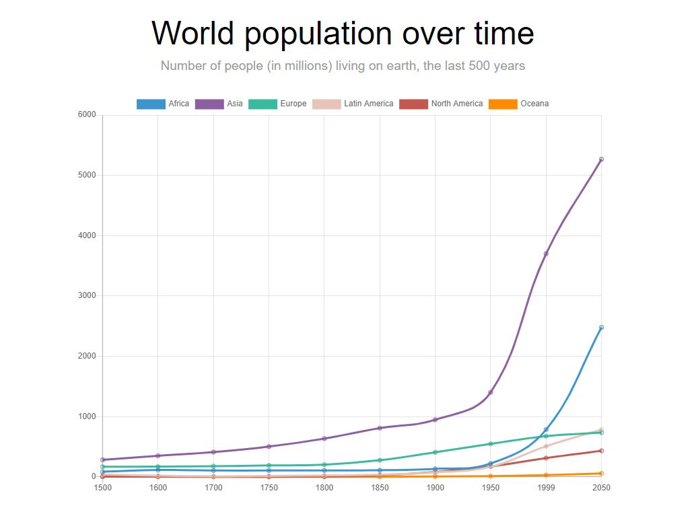
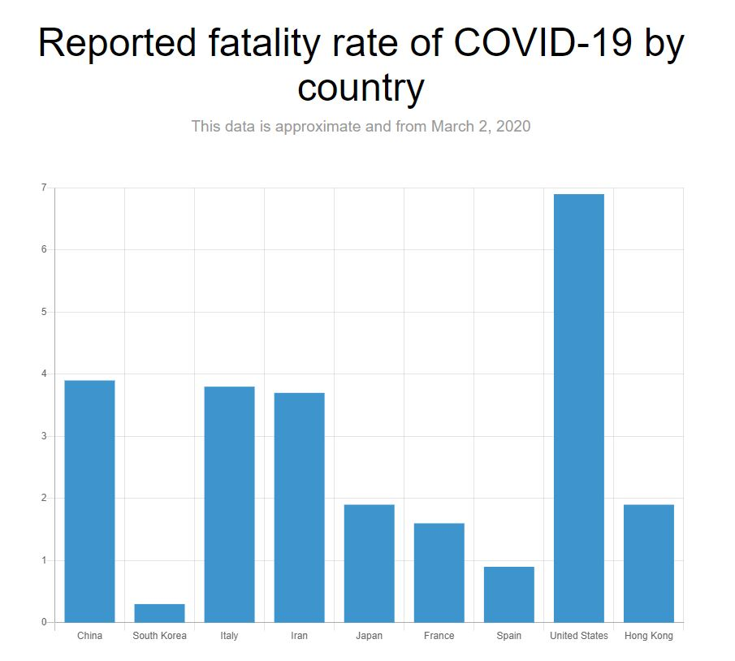

# Lab 5: Charts and graphs with JavaScript

## TGIS 504, Winter 2020, Dr. Emma Slager

#### Introduction

While maps are obviously an incredibly powerful tool of data visualization, graphs and charts also have a place in geospatial communication. In this lab, you'll learn how to use an open source JavaScript library called Chart.js to make dynamic, responsive, accessible charts for web and mobile. 

[Chart.js](https://www.chartjs.org/) is one of many different options that exist for making charts and graphs with JavaScript. Other common libraries include [D3.js](https://d3js.org/) and [Chartist.js](https://gionkunz.github.io/chartist-js/). While each has its own advantages, I've chosen to use Chart.js for this lab because it is relatively easy to use, has good documentation, and is an overall great option for simple charts and graphs. 

#### Part 1: Your first Chart.js chart

Working with Chart.js isn't all that different from working with Leaflet or Mapbox GL. Set up requires: 

1. An html page with a link to the Chart.js library in its head and a definition of where on the body of the page you want to draw the graph
2. Some JavaScript code that defines what type of graph you want to draw and provides data, labels, and sets various options for how the graph should look and behave
3. Some CSS code to provide the page styling and graph styling

To begin, download the template files (html, css, and js) from GitHub and save them in a new repository. Open them in Atom or the text editor of your choice and follow these steps. We'll use these files to make a line graph of world population by continent over the last 500 years, with a predicted values for 2050. 

**Step 1: Add Chart.js** 

Inside ```<script>``` tags in the ```head``` of the index, add a link to the chart.js library. Note that you only need to link to a js file, not a css file like you do with the mapping platforms we've used. Use one of the CDNs recommended on the chartjs.org website: https://www.chartjs.org/docs/latest/getting-started/installation.html

**Step 2: Prepare a place in the HTML page to render the chart**

With Leaflet or Mapbox, we add a map by creating a ```div``` element to hold the map. With Chart.js, we use a ```canvas``` element instead. Much like the map divs, you give the element an id and define a height and width. 

Inside the ```body``` of the html page, note that there is a div (with class "wrapper" that is styled in the css) that holds a title and subtitle for the population chart. Below these, add the following code:

```html
<canvas id="myChart" width="1600" height="900"></canvas>
```

As with our mapping platforms, the ID can be set to any value you choose, and you can add multiple charts to the same webpage by using unique IDs for each one. What matters is that you use the same ID when you reference the element in the js or css. 

Note that the width and height are defined here in pixels rather than a relative unit like percent. This is a limitation of the canvas element, but Chart.js has built-in functionality that, by default, detects when the canvas display size changes and updates the render size accordingly. So, chart.js charts should still look great on mobile! You can read more about the responsiveness of the library here: https://www.chartjs.org/docs/latest/general/responsive.html

**Step 3: Prepare the data**

The data for this chart comes from [Wikipedia's article on world population](https://en.wikipedia.org/wiki/World_population#Population_growth_by_region). Here's what it looks like in table form: 

**World historical and predicted populations (in millions)**

| **Region**        | 1500 | 1600 | 1700 | 1750 | 1800 | 1850 | 1900 | 1950 | 2000 | 2050 |
| ----------------- | ---- | ---- | ---- | ---- | ---- | ---- | ---- | ---- | ---- | ---- |
| **Africa**        | 86   | 114  | 106  | 107  | 107  | 111  | 133  | 221  | 783  | 2478 |
| **Asia**          | 282  | 350  | 411  | 635  | 635  | 809  | 947  | 1402 | 3700 | 5267 |
| **Europe**        | 168  | 170  | 178  | 203  | 203  | 276  | 408  | 547  | 675  | 734  |
| **Latin America** | 40   | 20   | 10   | 24   | 24   | 38   | 74   | 167  | 508  | 784  |
| **North America** | 6    | 3    | 2    | 7    | 7    | 26   | 82   | 172  | 312  | 433  |
| **Oceania**       | 3    | 3    | 2    | 2    | 2    | 2    | 6    | 13   | 30   | 57   |

One of the limitations of Chart.js, in my opinion, is that the data must be very specifically formatted. Each row, including the labels for the x-axis, must be written as an individual array. Although this is relatively simple, this pre-formatting can take some time. For this first chart, I've formatted the data for you. You can add the following arrays, each defined as a named ```var```, to your JavaScript file:

``` javascript
// labels along the x-axis
var years = [1500,1600,1700,1750,1800,1850,1900,1950,1999,2050];
// For drawing the lines
var africa = [86,114,106,106,107,111,133,221,783,2478];
var asia = [282,350,411,502,635,809,947,1402,3700,5267];
var europe = [168,170,178,190,203,276,408,547,675,734];
var latinAmerica = [40,20,10,16,24,38,74,167,508,784];
var northAmerica = [6,3,2,2,7,26,82,172,312,433];
var oceana = [3,3,2,2,2,2,6,13,30,57];
```

**Step 4: Rendering the chart**

Once your data is formatted, rendering the chart is fairly straightforward. Start by drawing just one of the data lines before adding the rest of the data. Below the arrays of data you just added to the js file, add the following code: 

```javascript
var ctx = document.getElementById("myChart");
var myChart = new Chart(ctx, {
  type: 'line',
  data: {
    labels: years,
    datasets: [
      { 
        data: africa
      }
    ]
  }
});
```

Open up your index file in a browser and preview what you've made. You should see a graph with a title, subtitle, and a single line of data representing the population of Africa from 1500-2050. Back in Atom, examine each line of the code and be sure you understand what it does. 

The first line locates the ```canvas``` element by its ID ("myChart"). Then, you create a chart in that canvas of the  type 'line'. If you were making a different kind of chart--say a bar chart or pie chart--you would define it with a different type keyword (see the full list of available chart types in the chart.js documentation here: https://www.chartjs.org/docs/latest/charts/). 

Next you pass in your data: first, the array of labels for the x-axis, then the first dataset. `years` and `africa` here do not need to be in quotes because they are variables that were defined above, not mere string values. If you wanted, you could enter the arrays (inside square brackets) here directly, but I find that adding them as vars and referencing them by name is a tidier way to keep my data organized. 

The `datasets` part of the code is an array, and inside that array is a list of objects. Recall that objects in JavaScript are variables that contain values in key:value pairs. In a chart.js dataset array, every object must have a data key. But we can also include other key:value pairs to do things like style and label the data. 

**Step 5: Styling your chart & adding the rest of your data**

Back in your web browser, notice that the y-axis has been automatically generated and that there is a legend at the top of the chart. This is built into the chart.js functionality. However, the label in the legend is 'undefined'. You can define the label and change the appearance and behavior of the line by making some adjustments to the data object. After ```data: africa```, add a comma and create a new line of code that reads ```label: "Africa",```

```javascript
data: africa,
label: "Africa"
```

Save your work and view it in the web browser. The 'undefined' label in the legend should now read 'Africa'. Style the line by adding the following two key:value pairs to your code: 

```javascript
borderColor: "#3e95cd",
fill: false
```

View your changes again. You should see a blue line, labeled Africa with no fill below the line. Nice work! Add the data for the rest of the regions with the appropriate data variables and labels: 

```javascript
{ 
  data: africa,
  label: "Africa",
  borderColor: "#3e95cd",
  fill: false
},
{ 
  data: asia,
  label: "Asia",
  borderColor: "#3e95cd",
  fill: false
},
{ 
  data: europe,
  label: "Europe",
  borderColor: "#3e95cd",
  fill: false
},
{ 
  data: latinAmerica,
  label: "Latin America",
  borderColor: "#3e95cd",
  fill: false
},
{ 
  data: northAmerica,
  label: "North America",
  borderColor: "#3e95cd",
  fill: false
}
  data: oceana, 
  label: "Oceana",
  borderColor: "#3e95cd",
  fill: false
```

Change the colors of each of the newly added lines by giving the ```borderColor``` keys new hexidecimal color values. You can use any colors you choose, or use these: `#8e5ea2`, `#3cba9f`, `#e8c3b9`, `#c45850 `, `#ff8c00`. Your final graph should look something like this, with built-in tool-tip functionality and responsiveness that you can check by adjusting the size of your web browser. 



### Part 2: Building a Bar Chart

In the same webpage as you put the first chart, add a second, this time a bar chart. This chart will be of COVID-19 fatality rates, as reported on March 4, 2020. Follow the steps below, applying what you learned in Part 1 as necessary. You may find the following example of a basic chart.js bar chart useful as you proceed: https://tobiasahlin.com/blog/chartjs-charts-to-get-you-started/#1-bar-chart

* In the "wrapper" div on the html page, add a second chart title, subtitle, and canvas. Create an appropriate ID for the canvas and use the same height and width as you used for the first chart. 

* In the script.js file, use the following arrays to store your bar chart's data: 

  ```javascript
  var countries = ["China", "South Korea", "Italy", "Iran", "Japan", "France", "Spain", "United States", "Hong Kong"];
  var mort_rates = [3.9, 0.3, 3.8, 3.7, 1.9, 1.6, 0.9, 6.9, 1.9]
  ```

* Below your data, instantiate a new chart, referencing the canvas ID where necessary. Define its type, data, and options as follows: 

  ```javascript
    type: 'bar',
      data: {
        labels: countries,
        datasets: [
          {
            label: "Percent of reported cases that have been fatal",
            backgroundColor: "#3e95cd",
            data: mort_rates
          }
        ]
      },
      options: {
        legend: { display: false },
        }
      }
  ```

* Your chart should now look something like this: 



* In a paragraph tag in the html, provide a short bit of explanatory text explaining and interpreting the chart for your users. What do you think accounts for the different fatality rates among these countries? Is the disease really more deadly in the United States than it is in South Korea? See this brief article in *The Atlantic* for context: https://www.theatlantic.com/technology/archive/2020/03/how-many-americans-really-have-coronavirus/607348/
* Host the webpage that contains the two charts you made in Part 1 and Part 2 on Github or your UW server space and submit a link to the page with your lab deliverables. 

### Part 3: Creating charts with your own data

In this section of the lab, I want you to create two charts of your own design that use data of your choosing. As you're thinking of charts to create, you might revisit some of the labs you completed in TGIS 503 last quarter: would any of the maps you made be well supplemented by a chart that summarizes the data in a non-cartographic visualization? Feel free to be creative and have fun with this. 

Remember these basic steps for creating visualizations with chart.js: 

* Add links to necessary libraries in your html `head`
* Prepare a place in the html to render the chart
* Prepare your data. This is likely to be one of the most time-consuming aspects of the lab, as most data you might download from open data portals, for instance, will be in table format or json format and needs to be reformatted into arrays that can be rendered by chart.js. Plan accordingly! 
* Render your chart and style it with JavaScript

Utilize the chart.js documentation as you work on this (especially for styling), and feel free to search for additional tutorials to help you achieve what you want to achieve. You may use any chart style, but part of your grade will be based on how appropriate the chart style is to the data you have chosen to visualize. You may add your charts to webpages you have created previously in your coursework (e.g. your lab 5 product from autumn quarter's TGIS 503 class) or produce new webpage(s) for the two charts you make. 

### Deliverables

* Link to one webpage that displays the graphs you made in Part 1 and Part 2
* Link(s) to webpage(s) that display the two graphs you made in Part 3

